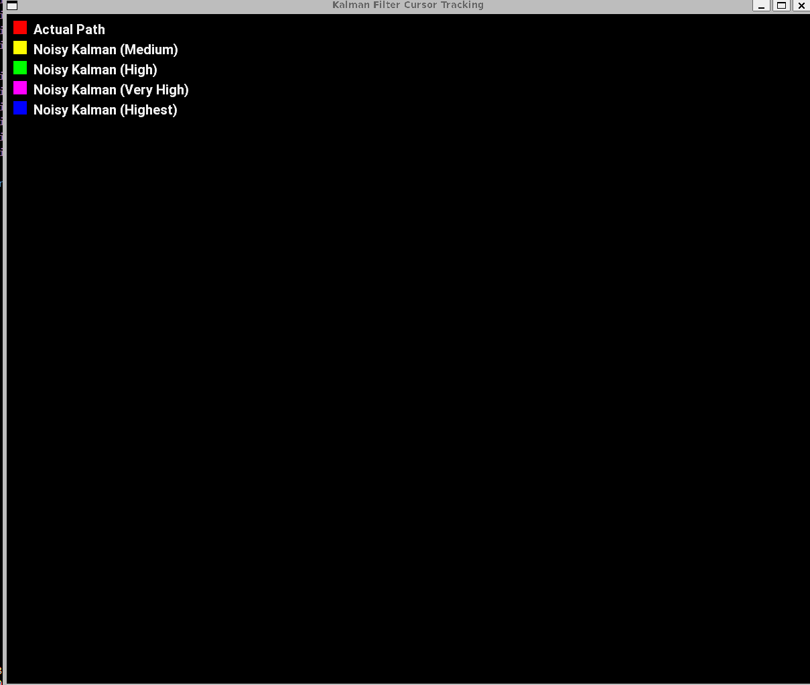
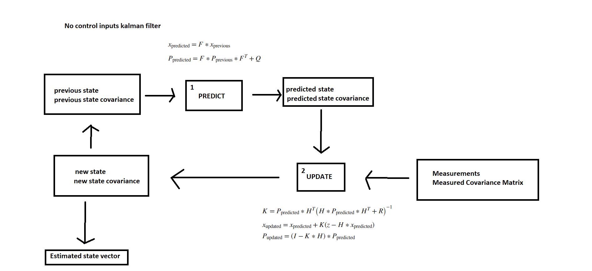

# Cursor predicting signal processing

This repo contains applications for following cursor position. *(currently only velocity model kalman filter)* (the matrixes are probably wrong since I don't
actually know how the systems are formulated, but no matter because it seems
to work :D)

This repo is supposed to have multiple applications which are coming in the
future as I get more acquainted with kalman filters first, then will
do a extended kalman filter, uncented kalman filter, particle filter and 
neural networks and other models. **Goal is to determine which model
is best for tracking noisy cursor**.

This is a vscode project with vscode cmake-tools and c++ extensions you can
easily run the **VelocityDemo**  by just pressing one button and running it.

In the following demo the actual path is Red line and all other lines
are kalman filter estimates of the Red line, when the Red line actual position
is feeded into the kalman filter with gaussian (*normal*) noise. The velocity model
just uses the speed between the current state and the last state and also the Q
matrix we compute the process noise depending on the timestep we fed the data into
 the kalman filter, since if our max acceleration is lets say 200 pixels/s^2 it
 has great difference that if the timedelta between datapoints is 0.1 sec or 1sec.

**Yellow** is with actual cursor position + gaussian noise with variance of 5.0 pixels

**Green** is with actual cursor position + gaussian noise with variance of 25.0 pixels

**Magenta** is with actual cursor position + gaussian noise with variance of 35.0 pixels

**Blue** is with actual cursor position + gaussian noise with variance of 35.0 pixels

The actual software is much smoother than the gif since it has unlimited fps

A demo is also at [youtube](https://www.youtube.com/watch?v=pxXbFduKZm0)
, but it conveys the same information as the gif

## Kalman filter

[Kalman filterering](https://en.wikipedia.org/wiki/Kalman_filter) is a algorithm to estimate a phenomenom from noisy measurements. A basic block
diagram of kalman filter without control inputs is

1. We predict based on the system model the next state
2. We update the state with the model predictions and the new measurements

The estimation for actual measurements is the state vector coming from the update step.

Depending on how we initialize the F, Q and H we can estimate different phenomenons

### Velocity model

I don't have enough education on systems and control theory I could explain
how the matrixes are formulated but they atleast seem to work :D This
is going to change since I'm taking control theory courses.